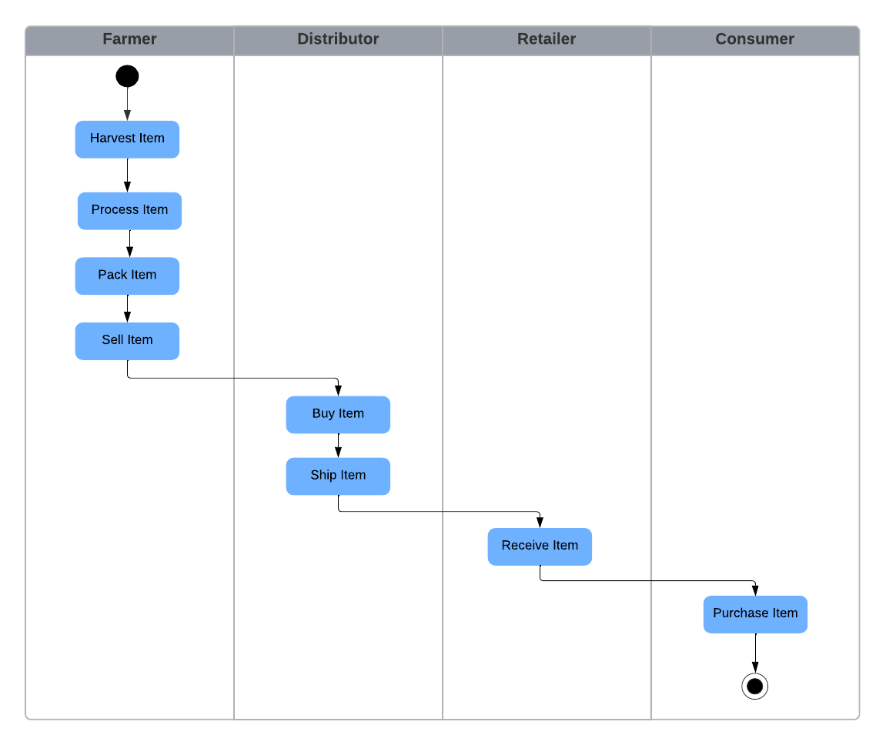
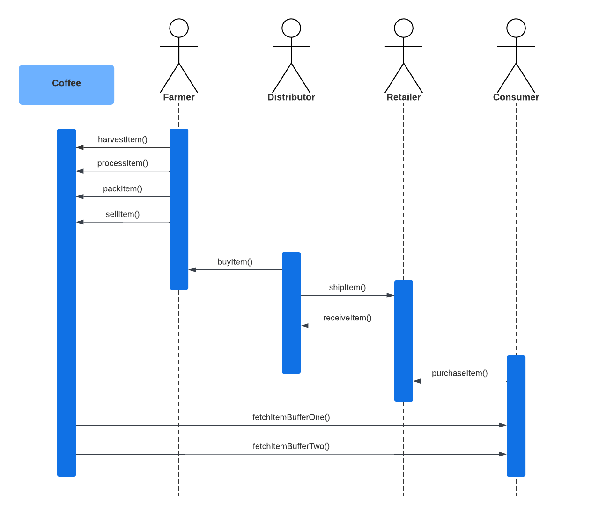
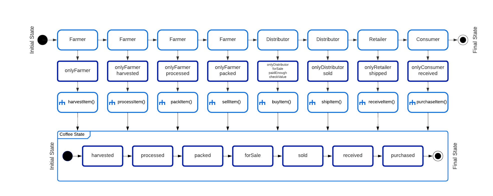
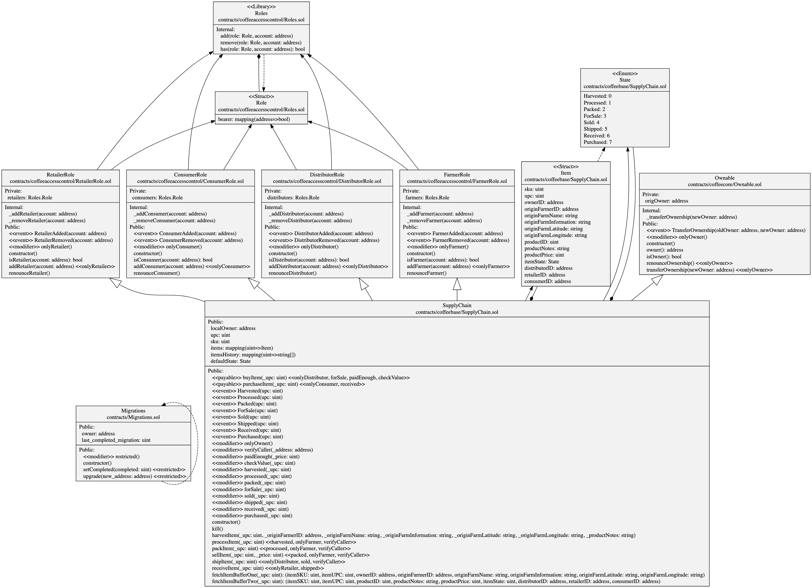

# Ethereum Dapp for Tracking Items through Supply Chain

This repository contains an Ethereum Dapp that demonstrates how to track items through a supply chain.

## Project Requirements

### Architecture

- [x] General write up e.g. steps and contracts address
- [x] Project write-up - UML
  - [x] Activity
  - [x] Sequence
  - [x] State
  - [x] Classes (Data Model)
- [x] Project write-up - Libraries
- [x] Project write-up - IPFS

### Smart contracts requirements

- [x] SupplyChain.sol contains required tracking functions.
- [x] Ownable.sol contains required functions that establish owner and the transfer of ownership.
- [x] ConsumerRole.sol contains required functions that manage the consumer role.
- [x] RetailerRole.sol contains required functions that manage the consumer role.
- [x] DistributorRole.sol contains required functions that manage the consumer role.
- [x] Additional roles implemented are integrated correctly.

### Testing

- [x] Tests for smart contract functions are written using Chai assertions.
- [x] All tests pass.

### Deploy smart contract on a public test network

- [x] Contract is deployed on the Goerli testnet.
- [x] Contract address and transaction hash are documented.

### Frontend

- [x] Frontend is implemented using web3.js to interact with the smart contracts.
- [x] Use Cases: Submit a product for shipment, receive product from shipment, validate the authenticity of the product.

## IPFS

IPFS has not been used in this project.

## Libraries

The following libraries have been used in this project:

- node v10.13.0
- npm@6.4.1
- truffle@4.1.14
- Solidity v0.4.24 (solc-js)
- @truffle/hdwallet-provider@2.1.15
- lite-server@2.4.0
- text-encoding@0.7.0
- web3@1.10.0
- sol2uml@2.5.14

## Steps

### Compilation

```
truffle(develop)> compile
Compiling ./contracts/Migrations.sol...
Compiling ./contracts/coffeeaccesscontrol/ConsumerRole.sol...
Compiling ./contracts/coffeeaccesscontrol/DistributorRole.sol...
Compiling ./contracts/coffeeaccesscontrol/FarmerRole.sol...
Compiling ./contracts/coffeeaccesscontrol/RetailerRole.sol...
Compiling ./contracts/coffeeaccesscontrol/Roles.sol...
Compiling ./contracts/coffeebase/SupplyChain.sol...
Compiling ./contracts/coffeecore/Ownable.sol...
Writing artifacts to ./build/contracts

truffle(develop)>
```

### Testing

```
truffle(develop)> test
Using network 'develop'.

ganache-cli accounts used here...
Contract Owner: accounts[0]  0x627306090abab3a6e1400e9345bc60c78a8bef57
Farmer: accounts[1]  0xf17f52151ebef6c7334fad080c5704d77216b732
Distributor: accounts[2]  0xc5fdf4076b8f3a5357c5e395ab970b5b54098fef
Retailer: accounts[3]  0x821aea9a577a9b44299b9c15c88cf3087f3b5544
Consumer: accounts[4]  0x0d1d4e623d10f9fba5db95830f7d3839406c6af2


  Contract: SupplyChain
    ✓ Testing smart contract function harvestItem() that allows a farmer to harvest coffee (353ms)
    ✓ Testing smart contract function processItem() that allows a farmer to process coffee (76ms)
    ✓ Testing smart contract function packItem() that allows a farmer to pack coffee (67ms)
    ✓ Testing smart contract function sellItem() that allows a farmer to sell coffee (76ms)
    ✓ Testing smart contract function buyItem() that allows a distributor to buy coffee (105ms)
    ✓ Testing smart contract function shipItem() that allows a distributor to ship coffee (83ms)
    ✓ Testing smart contract function receiveItem() that allows a retailer to mark coffee received (85ms)
    ✓ Testing smart contract function purchaseItem() that allows a consumer to purchase coffee (86ms)
    ✓ Testing smart contract function fetchItemBufferOne() that allows anyone to fetch item details from blockchain (52ms)
    ✓ Testing smart contract function fetchItemBufferTwo() that allows anyone to fetch item details from blockchain


  10 passing (1s)

truffle(develop)>
```

### Deployment

The contract has been deployed to Goerli using Remix IDE and the following transaction hash and contract address have been obtained:

```
Transaction Hash: 0x58c67f06b6605bb729171589b52acf73ff0bd471a2d59685df7810eff983e3d4
Contract Address: 0x57733E3AEfFB45d2AFC40E7aD3e9aA0B3e0A574d
Contract Owner: 0x80CB4FebdA6d1003549b6B6c2d298aa5C9f6e832
```

Deployment using Truffle migrate was not possible due to the old Node version being used in the upstream project and the lack of native TextEncoder support in NodeJS 10.

Etherscan Transaction: https://goerli.etherscan.io/tx/0x58c67f06b6605bb729171589b52acf73ff0bd471a2d59685df7810eff983e3d4

### Contract Initialization Logs

```
[
	{
		"from": "0x57733E3AEfFB45d2AFC40E7aD3e9aA0B3e0A574d",
		"topic": "0x5c486528ec3e3f0ea91181cff8116f02bfa350e03b8b6f12e00765adbb5af85c",
		"event": "TransferOwnership",
		"args": {
			"0": "0x0000000000000000000000000000000000000000",
			"1": "0x80CB4FebdA6d1003549b6B6c2d298aa5C9f6e832",
			"oldOwner": "0x0000000000000000000000000000000000000000",
			"newOwner": "0x80CB4FebdA6d1003549b6B6c2d298aa5C9f6e832"
		}
	},
	{
		"from": "0x57733E3AEfFB45d2AFC40E7aD3e9aA0B3e0A574d",
		"topic": "0x28b26e7a3d20aedbc5f8f2ebf7da671c0491723a2b78f47a097b0e46dee07142",
		"event": "ConsumerAdded",
		"args": {
			"0": "0x80CB4FebdA6d1003549b6B6c2d298aa5C9f6e832",
			"account": "0x80CB4FebdA6d1003549b6B6c2d298aa5C9f6e832"
		}
	},
	{
		"from": "0x57733E3AEfFB45d2AFC40E7aD3e9aA0B3e0A574d",
		"topic": "0xddbf200aa634dc3fb81cfd68583dd1040d1c751d335e1d86b631bde3e977fea8",
		"event": "DistributorAdded",
		"args": {
			"0": "0x80CB4FebdA6d1003549b6B6c2d298aa5C9f6e832",
			"account": "0x80CB4FebdA6d1003549b6B6c2d298aa5C9f6e832"
		}
	},
	{
		"from": "0x57733E3AEfFB45d2AFC40E7aD3e9aA0B3e0A574d",
		"topic": "0x2e0ded4123377a3c2bc9a26f1717655a129e2f20752924d42e730ec89c83dbd0",
		"event": "FarmerAdded",
		"args": {
			"0": "0x80CB4FebdA6d1003549b6B6c2d298aa5C9f6e832",
			"account": "0x80CB4FebdA6d1003549b6B6c2d298aa5C9f6e832"
		}
	},
	{
		"from": "0x57733E3AEfFB45d2AFC40E7aD3e9aA0B3e0A574d",
		"topic": "0x71ae26cad02663e3d92efd6ec56031a80d74a20c0ab4183faa8bf262261c9baa",
		"event": "RetailerAdded",
		"args": {
			"0": "0x80CB4FebdA6d1003549b6B6c2d298aa5C9f6e832",
			"account": "0x80CB4FebdA6d1003549b6B6c2d298aa5C9f6e832"
		}
	}
]
```

## UML Diagrams

The following UML diagrams have been created for this project using Lucidchart:

### Activity



### Sequence



### State Diagram



### Class Diagram (Data Model)

The following diagram has been generated from the contract files under the contracts folder in this repository using sol2uml:


